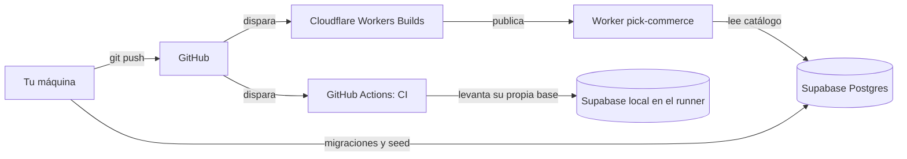

# Infraestructura

Cómo corre este proyecto fuera de tu editor: qué máquinas intervienen, qué hace
cada una, de dónde saca sus credenciales y qué mirar cuando algo falla.

No es un ADR: no decide nada. Los ADR-055 a 062 de [DECISIONS.md](DECISIONS.md)
tienen el _por qué_ de cada decisión; esto es el _cómo funciona hoy_, junto.

---

## 1. Las cuatro piezas

| Pieza          | Qué es                                    | Qué guarda                                    | Quién la paga            |
| -------------- | ----------------------------------------- | --------------------------------------------- | ------------------------ |
| **Tu máquina** | Donde escribís código y corrés `pnpm dev` | El `.env` con las credenciales reales         | —                        |
| **GitHub**     | Guarda el código y corre el **CI**        | Nada secreto. El repo no tiene una sola clave | Gratis en repos públicos |
| **Cloudflare** | Ejecuta el sitio: los **Workers**         | Los secretos de runtime del Worker            | Plan de Workers          |
| **Supabase**   | La base Postgres con el catálogo          | **Todos los datos**                           | Plan de Supabase         |

Ninguna sabe de las otras salvo por las credenciales que vos les cargaste.
Cloudflare no mira el CI; el CI no mira Cloudflare; los dos hablan con Supabase
sólo si tienen la URL y la clave.



Fijate en la asimetría del dibujo: **el CI nunca toca Supabase de verdad**, se
levanta uno propio y descartable. Y **el deploy no pasa por el CI**: son dos
ramas independientes que salen del mismo push. Volvemos a esto en §4.

---

## 2. El mismo código corriendo en tres lugares

Esto es lo que más confunde, porque el artefacto es el mismo y lo único que
cambia es de dónde salen las credenciales.

|                        | Tu máquina                    | El runner del CI                                      | Producción                                    |
| ---------------------- | ----------------------------- | ----------------------------------------------------- | --------------------------------------------- |
| Quién ejecuta          | `astro dev` o `astro preview` | Ubuntu efímero de GitHub                              | Worker de Cloudflare                          |
| Base de datos          | El proyecto Supabase remoto   | Un Supabase local en Docker, que muere con la corrida | El proyecto Supabase remoto                   |
| Credenciales           | `.env` en la raíz del repo    | Las imprime `supabase status` al arrancar             | Secretos del Worker en el panel de Cloudflare |
| Vida útil de los datos | Permanente                    | ~15 minutos                                           | Permanente                                    |

Un detalle que parece trivial y no lo es: `astro preview` **no** es Node, es
**workerd** —el mismo motor que Cloudflare— corriendo en tu máquina. Por eso no
ve `process.env` y necesita el archivo `.dev.vars`. Cuando corrés `pnpm e2e`
estás probando el binario que se despliega, no una imitación.

---

## 3. El CI: qué hace y qué no

Vive en [.github/workflows/ci.yml](.github/workflows/ci.yml). Se dispara con cada
push a `main` y con cada pull request.

### Los pasos, en orden y con su razón

| #   | Paso                                          | Para qué                                                                                       | Si falla, es porque…                                   |
| --- | --------------------------------------------- | ---------------------------------------------------------------------------------------------- | ------------------------------------------------------ |
| 1   | `checkout` + `pnpm install --frozen-lockfile` | Clon limpio con las versiones exactas del lockfile                                             | El `pnpm-lock.yaml` no coincide con los `package.json` |
| 2   | `pnpm lint`                                   | ESLint en todo el workspace                                                                    | Código que no cumple las reglas                        |
| 3   | `pnpm typecheck`                              | `tsc` y `astro check`                                                                          | Tipos rotos                                            |
| 4   | `pnpm format:check`                           | Prettier sobre todo el repo                                                                    | Un archivo sin formatear                               |
| 5   | `pnpm docs:check`                             | Las contradicciones mecánicas de los documentos                                                | Un comando, una ruta o un ADR citado que no existe     |
| 6   | `pnpm test`                                   | Unitarios + aislamiento entre tenants sobre **PGlite** (Postgres compilado a WASM, sin Docker) | Un test detectó una regresión                          |
| 7   | `supabase start`                              | Levanta Postgres, Auth y API de verdad en el runner y aplica las migraciones                   | Una migración no aplica desde cero                     |
| 8   | Exportar credenciales                         | Toma la URL y las claves del stack recién levantado y las mete en el entorno                   | Cambió el nombre de las claves en el CLI               |
| 9   | `pnpm build`                                  | Construye admin y storefront                                                                   | El build se rompió                                     |
| 10  | `playwright install chromium`                 | Baja el navegador                                                                              | Red                                                    |
| 11  | `pnpm e2e`                                    | Navegación real, desktop y mobile, contra el build servido por workerd                         | Un critical path se rompió                             |

Los pasos 1 a 6 no necesitan base. Recién del 7 en adelante hace falta, porque
desde la Fase 4 el storefront lee el catálogo de Postgres en cada petición.

Los pasos 4 y 5 son del 2026-09-12. `format:check` existía desde la Fase 0 y el
CI nunca lo invocaba: cuando por fin se corrió estaba en rojo con 26 archivos, y
nadie se había enterado. `docs:check` es nuevo —`scripts/docs-check.mjs`— y
corta lo que en un documento es mecánico: un `pnpm <algo>` que ningún
`package.json` tiene, una ruta que ya no está en el disco, un `ADR-NNN`
inventado, un avance declarado fuera del ROADMAP. Que un documento diga la
verdad no lo puede comprobar un script; que no se contradiga con el repo, sí.

### Lo importante: no hay ningún secreto en el CI

Ni en el repo ni en la configuración de GitHub. El paso 7 **fabrica** una base
desde cero con las migraciones del repo, y el 8 lee las credenciales que esa base
acaba de imprimir. Consecuencias:

- Nadie puede filtrar una clave desde el CI, porque no hay ninguna.
- Una corrida **del CI** no puede ensuciar ni romper el proyecto Supabase real,
  porque no lo ve. **Un `pnpm e2e` en tu máquina sí le escribe**: lee el `.env` de
  la raíz, y `scripts/preparar-storefront-e2e.ts` le cambia el nombre a la tienda
  de la demo —«Pick Demo (smoke)»— y le pisa `settings.shipping` para ejercitar el
  costo de envío. Esta promesa estaba escrita sin acotar y era falsa de ese lado:
  el storefront público estuvo en producción titulado «Pick Demo (smoke)», que es
  material de venta con el nombre de una corrida de test. Desde el 2026-09-12
  `scripts/limpiar-e2e.ts` lo restituye al estado que siembra el seed, en el
  teardown de Playwright. O sea: en el CI la promesa es de la arquitectura; en tu
  máquina depende de que el teardown corra, así que una corrida interrumpida a
  mano puede dejar la tienda renombrada.
- El CI prueba que **las migraciones aplican desde cero**, que es distinto de que
  el proyecto remoto funcione: el remoto podría estar funcionando por algo que
  alguien tocó a mano y no quedó en una migración.

Esto es ADR-058.

**Cuánto tarda, medido en una corrida completa en verde** (`a30f795`,
26/08/2026): **3m 37s de punta a punta**. El reparto:

| Paso                           | Tiempo             |
| ------------------------------ | ------------------ |
| `supabase start`               | 1m 45s             |
| `playwright install`           | 26s                |
| `pnpm typecheck`               | 16s                |
| `pnpm install`                 | 11s                |
| `pnpm test` + `lint` + `build` | 16s entre los tres |
| `pnpm e2e`                     | 29s                |

Casi todo el tiempo es levantar Postgres y bajar Chromium; lo que el repo tiene
que verificar de verdad se hace en menos de un minuto. Una corrida sana no pasa
de cuatro minutos: **si ves una de cuarenta, no está lenta, está colgada**.

### `cancelled` no es `failure`

El workflow declara:

```yaml
concurrency:
  group: ${{ github.workflow }}-${{ github.ref }}
  cancel-in-progress: true
```

Si hacés tres pushes seguidos, las dos primeras corridas se **cancelan solas**.
No fallaron: se abandonaron a propósito, porque validar un commit que ya no es la
punta de la rama es tiempo tirado.

**Ojo con el badge**: GitHub pinta las corridas canceladas igual que las
fallidas. Hoy el badge dice `CI - failing` y en el repo no hay ningún fallo: las
tres últimas corridas terminadas fueron `cancelled` por esa regla. Para saber la
verdad hay que abrir la corrida y mirar su conclusión, no el badge.

### Dónde mirar

`https://github.com/chvpa/Pick-Commerce/actions` → la corrida → el job `verify`.
Cada paso se despliega y muestra su salida. Si el e2e falla, el workflow sube el
`playwright-report` como artifact descargable, con capturas y trazas.

---

## 4. Cloudflare: los Workers y el deploy

### Qué es un Worker

Una función que Cloudflare ejecuta en su red cada vez que llega una petición. No
hay servidor encendido esperando: arranca, responde y desaparece. Por eso no
tiene disco, ni `process.env`, ni Node completo —de ahí el
`compatibility_flags: ["nodejs_compat"]` en la config—.

### Los tres Workers de este proyecto

| Worker          | App             | Qué sirve                                                                      | Estado                                                                           |
| --------------- | --------------- | ------------------------------------------------------------------------------ | -------------------------------------------------------------------------------- |
| `pick-commerce` | `apps/demo`     | El storefront de la demo. Mezcla páginas estáticas y páginas on-demand         | En línea: https://pick-commerce.chvpa-contacto.workers.dev                       |
| `treeshop`      | `apps/treeshop` | El storefront de Treeshop, el primer cliente (ADR-110)                         | En línea: https://treeshop.chvpa-contacto.workers.dev → **sontres.shop**         |
| `pick-admin`    | `apps/admin`    | El Admin: una SPA de archivos estáticos **más** un Worker que atiende `/api/*` | En línea: https://pick-admin.chvpa-contacto.workers.dev → **admin.sontres.shop** |

**Un Worker por storefront, un solo Admin.** Cada cliente con app propia tiene
su Worker, con su `wrangler.jsonc` y su KV de sesiones —Wrangler lo crea solo
en el primer deploy, `treeshop-session`—. El Admin es uno para todos los
comercios y se sirve además bajo el dominio de cada cliente como subdominio.

El nombre lo declara `wrangler.jsonc` de cada app y **tiene que coincidir con el
Worker que ya existe** en Cloudflare. Con otro nombre, un deploy no actualiza el
sitio: crea un Worker nuevo al lado, y el viejo sigue sirviendo la versión
anterior. Ya pasó acá.

### Qué se resuelve estático y qué en cada petición

Astro genera las dos cosas en el mismo build:

- **Estáticas** (escritas en disco al construir): sólo `robots.txt` y
  `sitemap-index.xml`, las dos cosas que no dependen de ningún dato.
- **On-demand** (`export const prerender = false`): todo lo demás. Home,
  catálogo, ficha de producto, checkout, 404, políticas, FAQ, el `llms.txt` y el
  `sitemap-0.xml`. Y `/carrito`, que no lee la base y va on-demand igual: con
  Workers Assets una página prerenderizada **se sirve desde el disco sin ejecutar
  el Worker**, así que no corre el middleware. Y en `astro dev` y `astro preview`
  todo es SSR, o sea que la diferencia aparece recién al desplegar (ADR-099).

La regla es simple: si el contenido sale de la base, va on-demand. Si fuera
estático, cada producto que cargás en el Admin exigiría un redeploy para
aparecer. Ese es el motivo de que el Worker necesite credenciales de Supabase en
runtime, y no sólo al construir.

### Los dos caminos para desplegar

**Automático — Workers Builds.** Un solo proyecto, el del storefront de la
demo: Cloudflare está conectado al repo de GitHub y en cada push a `main` clona,
construye y publica.

| Ajuste         | `pick-commerce`                       |
| -------------- | ------------------------------------- |
| Build command  | `pnpm --filter @pick/demo run build`  |
| Deploy command | `pnpm --filter @pick/demo run deploy` |

**El Admin y Treeshop se despliegan a mano; sólo el storefront de la demo tiene
Workers Builds.** Para el Admin es lo que dice §10, y vale repetirlo acá porque
es la trampa: una pantalla nueva del Admin con el build, el typecheck y el
Playwright en verde **no existe** para quien la va a usar hasta que alguien
corra el deploy.

**Manual — desde tu máquina**, con `wrangler login` hecho una vez, o con
`CLOUDFLARE_API_TOKEN` cargado desde `.env`:

```bash
pnpm deploy:demo     # construye y publica el storefront de la demo
pnpm deploy:admin    # ídem el Admin
SITE_URL=https://sontres.shop pnpm --filter @pick/treeshop run deploy   # Treeshop
```

El `SITE_URL` de Treeshop va explícito en la línea porque `.env` trae el de la
demo, y sin sobreescribirlo el canonical y el sitemap de Treeshop apuntarían a
la demo.

El `run` no es opcional: `deploy` es un comando propio de pnpm, y sin `run`
falla con `ERR_PNPM_INVALID_DEPLOY_TARGET` sin llegar nunca al script del
paquete.

### Dominios propios

Un Worker recibe un dominio propio sólo si la zona vive en Cloudflare: el
dominio se agrega como sitio (plan Free alcanza), el registrador —Namecheap, en
el caso de Treeshop— apunta sus nameservers a los dos que Cloudflare asigna, y
hasta que el DNS público no los muestre la zona queda `pending` y nada se
enruta. Los dominios se atan al Worker con _Domains & Routes_ del panel o por
API (`PUT /accounts/{cuenta}/workers/domains`), y Cloudflare crea el registro
DNS solo.

**Tres cosas que costaron una tarde con Treeshop, y no hay que repetir:**

- **Atar recién con la zona activa.** La API acepta el alta con la zona
  `pending`, pero esa entrada nunca llega a servir: al activarse la zona hay
  que borrarla y recrearla. Y cada recreación reemite el certificado del
  hostname —minutos a una hora hasta que el edge lo tiene—, así que se hace
  **una** vez y se espera; recrear para «apurar» reinicia el reloj.
- **La zona queda sin rutas de Workers.** Una ruta de zona (`*dominio/*`) le
  gana al dominio propio: con una que apunte al storefront, `admin.dominio`
  sirve la tienda. Los dominios propios no necesitan rutas.
- **El síntoma de «no hay Worker detrás» es TLS, no enrutamiento.** Sin
  certificado en el edge el navegador no negocia la conexión; `openssl
s_client` da _alert 40, no peer certificate_ y `/cdn-cgi/trace` no responde.
  Para saber qué Worker sirve un hostname sin adivinar por el título:
  `POST /api/ia/probar` existe sólo en el Admin.

El token de `.env` puede atar Workers pero **no** leer el DNS, las rutas ni el
estado SSL de la zona: para operar un dominio de cliente entero hacen falta
`Zone → DNS → Edit`, `Zone → Workers Routes → Edit` y
`Zone → SSL and Certificates → Read` sobre esa zona.

Lo que se ató para Treeshop:

| Hostname             | Worker       |
| -------------------- | ------------ |
| `sontres.shop`       | `treeshop`   |
| `www.sontres.shop`   | `treeshop`   |
| `admin.sontres.shop` | `pick-admin` |

Los tres en línea desde el 2026-09-11, verificados con la compra completa sobre
`https://sontres.shop` y el Admin respondiendo en su subdominio.

El `www` no necesita redirección: `resolverTenant` normaliza el host y las dos
formas sirven la misma tienda. `stores.domain` y el secreto `STOREFRONT_DOMAIN`
llevan el dominio sin `www`.

**El `robots.txt` que sale por el dominio propio no es sólo el del repo.**
Cloudflare le antepone su bloque _Managed content_, y eso cambia la política sin
que nadie la haya escrito acá: `curl -s https://sontres.shop/robots.txt` trae
`Content-Signal: search=yes,ai-train=no,use=reference` y un `Disallow: /` para
GPTBot, ClaudeBot, CCBot, Google-Extended, Amazonbot, Applebot-Extended,
Bytespider y meta-externalagent, y sólo después el bloque de
`apps/treeshop/src/pages/robots.txt.ts`. Vale saberlo porque el capítulo de GEO
se apoya en que lo que se indexa es el HTML del servidor: la regla de zona deja
pasar a los buscadores y corta a los crawlers de IA. Si eso no es lo que se
quiere, se desactiva en la zona de Cloudflare, no en el repo.

Dos cosas que un dominio nuevo rompe si nadie las toca:

- **Supabase Auth → URL Configuration → Redirect URLs** tiene que incluir el
  dominio del Admin (`https://admin.sontres.shop/**`), o el enlace de
  recuperación de contraseña vuelve al dominio viejo. Se cambia por la API de
  Management (`PATCH /v1/projects/{ref}/config/auth`, campo `uri_allow_list`).
- **Resend** tiene que verificar el dominio del que salen los correos
  (`EMAIL_FROM`). La clave de `.env` es **de sólo envío** y no puede dar de alta
  dominios: se hace desde el panel de Resend, que entrega los registros DNS, y
  esos registros se cargan en la zona de Cloudflare.

### ⚠ El CI no bloquea el deploy

Los dos salen del mismo push, pero **son independientes**: Cloudflare no espera
a GitHub Actions ni le pregunta nada. Un commit que rompe los tests se despliega
igual, y llega a producción antes de que el CI termine —hoy mismo el sitio quedó
actualizado a los ~20 segundos de un push mientras la corrida seguía, y sigue
corriendo casi una hora después—.

Hoy no muerde porque trabajás directo sobre `main` y sos el único. Cuando importe,
se arregla desplegando desde el propio CI —con el deploy como último paso,
después del e2e— y desconectando Workers Builds. Está anotado en el backlog del
[ROADMAP](ROADMAP.md).

### Variables de build ≠ secretos de runtime

Este es el punto que costó tres intentos y vale entenderlo bien.

|                        | Variables de build                              | Secretos de runtime                   |
| ---------------------- | ----------------------------------------------- | ------------------------------------- |
| Cuándo se leen         | Mientras Cloudflare construye                   | En cada petición al sitio             |
| Quedan en el bundle    | Sí, incrustadas                                 | No, viven en el entorno del Worker    |
| Dónde se cargan        | _Settings › Build › Variables_                  | _Settings › Variables and Secrets_    |
| Qué pone este proyecto | `SITE_URL` si querés fijar la dirección pública | `SUPABASE_URL`, `SUPABASE_SECRET_KEY` |

Poner la clave de Supabase como variable de build no sólo no funciona: la
**incrustaría en el artefacto**. Y ponerla sólo ahí deja al Worker sin nada que
leer cuando llega una petición.

### Por qué faltar una variable daba un 500 vacío

`astro:env` valida **todos** los secretos declarados al cargar el módulo, aunque
la página no use ninguno. El código generado hace, en su cuerpo:

```js
var SUPABASE_URL = _internalGetSecret('SUPABASE_URL');
```

Si falta, eso explota antes del middleware y antes de la ruta: el Worker
devuelve **500 con el cuerpo vacío**, sin decir qué falta ni que el problema sea
de configuración.

Por eso los dos secretos se declaran `optional: true` —no porque puedan faltar,
sino para que Astro no valide— y quien controla es
[src/middleware.ts](apps/demo/src/middleware.ts), que responde **503 con una
página que nombra las variables ausentes**. 503 y no 500 porque la aplicación
está sana, es el entorno el que no está listo, y un buscador que recibe 503
reintenta en vez de desindexar.

Si alguna vez ves esa pantalla: no es un bug, es el Worker diciéndote qué
cargarle.

---

## 5. Las variables, una por una

| Variable                                              | Qué es                                                              | Secreta                                               | Tu máquina       | CI                        | Worker                |
| ----------------------------------------------------- | ------------------------------------------------------------------- | ----------------------------------------------------- | ---------------- | ------------------------- | --------------------- |
| `SUPABASE_URL`                                        | Dirección del proyecto                                              | No, pero viaja como secreto                           | `.env`           | La imprime el stack local | Runtime               |
| `SUPABASE_SECRET_KEY`                                 | **Saltea RLS por completo**                                         | **Sí**                                                | `.env`           | Ídem                      | Runtime               |
| `SUPABASE_PUBLISHABLE_KEY`                            | Clave para el browser; la protege RLS                               | No                                                    | `.env`           | Ídem                      | No la usa             |
| `SUPABASE_ACCESS_TOKEN`                               | Token de tu **cuenta** Supabase, para el CLI y la API de Management | **Sí, y es la más peligrosa: ve todos tus proyectos** | `.env`           | No se usa                 | No se usa             |
| `VITE_SUPABASE_URL` / `VITE_SUPABASE_PUBLISHABLE_KEY` | Lo que el Admin expone al browser                                   | No                                                    | `.env`           | Ídem                      | —                     |
| `SITE_URL`                                            | Dirección pública del storefront                                    | No                                                    | `.env`, opcional | —                         | Variable de **build** |
| `STOREFRONT_DOMAIN`                                   | **Qué tienda sirve este deploy**                                    | No                                                    | Default          | Default                   | Variable pública      |

Dos que se confunden todo el tiempo y no son lo mismo:

- **`SITE_URL`** es la dirección desde la que se sirve el sitio. De ahí salen el
  canonical, el `og:url`, el JSON-LD y el sitemap. Si está mal, el sitio funciona
  perfecto y el SEO se anula en silencio —pasó: anunciaba un dominio inexistente
  durante un deploy entero—.
- **`STOREFRONT_DOMAIN`** es la **llave de búsqueda**: el Worker consulta
  `stores.domain` con ese valor para saber qué tienda mostrar. Tiene que coincidir
  con lo que dice la base, no con el dominio desde el que se sirve.

Hoy son distintas y está bien. Cuando la demo tenga dominio propio se cambian las
dos.

### Las que sólo necesita un script

Ninguna de éstas la lee una app: las lee un comando del repo, desde el `.env` de
la raíz. Van aparte porque **`.env.example` no las declara**, y un clon nuevo que
lo copie arranca sin poder desplegar a mano ni importar un catálogo, sin que nada
se lo diga hasta que el comando falla.

| Variable                                                     | Quién la lee                     | Para qué                                                                           |
| ------------------------------------------------------------ | -------------------------------- | ---------------------------------------------------------------------------------- |
| `CLOUDFLARE_API_TOKEN`                                       | `wrangler`                       | Desplegar sin `wrangler login`. También ata dominios al Worker, nada más           |
| `RESEND_API_KEY`                                             | El storefront                    | En producción es un **secreto del Worker**; en el `.env` sirve para `pnpm dev`     |
| `CAMELOT_SUPABASE_URL` + `CAMELOT_SUPABASE_SERVICE_ROLE_KEY` | `pnpm camelot:importar`          | Leer el Supabase del ecommerce anterior del cliente. Sólo lectura, sólo del origen |
| `LINODE_PROXY_URL` + `LINODE_PROXY_SECRET`                   | `pnpm erp:importar`              | Llegar al Oracle ORDS del ERP a través del proxy (ADR-085)                         |
| `TEST_SUPABASE_URL` + `TEST_SUPABASE_ANON_KEY`               | `pnpm erp:imagenes`              | El proyecto de origen del que se copian las fotos                                  |
| `PICK_AI_MASTER_KEY`                                         | El Worker del Admin y `pnpm dev` | Cifra las credenciales de IA. Está en §6, con lo que implica rotarla               |

Con eso, los caminos para cargar un catálogo son cuatro y cada uno tiene su
credencial: el CRUD del Admin y el CSV no necesitan ninguna, `pnpm erp:importar`
necesita el proxy del ERP, y `pnpm camelot:importar` necesita el Supabase de
origen: es el que usó Treeshop, que trajo su catálogo entero de un ecommerce
anterior (ADR-111). El paso a paso de cada uno vive en
[ONBOARDING.md](ONBOARDING.md).

`CLOUDFLARE_ACCOUNT_ID` no la lee ningún archivo del repo, pero sí la lee
`wrangler` del entorno, y hace falta: ningún `wrangler.jsonc` declara
`account_id`, así que sin ella un deploy a mano contra una cuenta ambigua no
sabe a dónde ir. Va declarada en `.env.example` junto al token.

Las otras tres —`CLOUDFLARE_S3_API_ENDPOINT`, `CLOUDFLARE_ACCESS_KEY_ID` y
`CLOUDFLARE_SECRET_ACCESS_KEY`— **no las lee nada**: ni un archivo del repo ni
una herramienta, comprobado por `grep` sobre todo el árbol. Son credenciales de
un almacenamiento S3 que este proyecto no usa —los medios van a Supabase
Storage, P-002 resuelta en ADR-082— y una credencial que nada usa es sólo
superficie de ataque: lo correcto es sacarlas del `.env` y revocarlas.

### La secret key, en una línea

Saltea RLS: con ella se ven los datos de **todos** los comercios. Por eso vive
sólo del lado del servidor, nunca lleva prefijo `VITE_` ni `PUBLIC_` —esos
prefijos son justamente los que inyectan el valor en el bundle del browser— y el
`.env` está en `.gitignore`. El Admin no la usa: entra con el token del usuario y
lo filtra RLS.

---

## 6. Supabase: la base

### Migraciones

Cada cambio de schema es un archivo en `supabase/migrations/`, y se aplica con:

```bash
pnpm db:apply supabase/migrations/<archivo>.sql
pnpm db:types      # regenera los tipos TypeScript desde el schema real
```

Va por la **API de Management**, que sólo necesita `SUPABASE_ACCESS_TOKEN`: no
hace falta Docker ni la password de la base. Los archivos son **append-only** —un
bug en una función SQL se arregla con un `create or replace` en una migración
nueva, nunca editando la vieja—, porque el CI las aplica desde cero y tienen que
poder correr en orden sobre una base vacía.

El script renombra el archivo local para que su versión coincida con la que
asignó el servidor. Si no, local y remoto divergen y el CLI empieza a mentir.

**Hoy hay una escrita y sin aplicar**:
`supabase/migrations/20260912183012_revocar_consume_promotion_de_public.sql`. Es
la segunda mitad de un arreglo que necesitó dos: `20260912173244` le quitó a
`authenticated` el permiso de ejecutar `app.consume_promotion` —una función
`security definer` que recibe un uuid arbitrario y no comprueba ni tenant ni
permiso— y **no alcanzó**, porque Postgres le da `execute` a `PUBLIC` a toda
función al crearla y ese grant sobrevive a revocarle a un rol puntual. La
primera está aplicada; la segunda espera su `pnpm db:apply`.

Es el caso que muestra el riesgo de esta sección entera: **el CI aplica las
migraciones desde cero y pasa, así que nada avisa de que el proyecto remoto no
las tiene**. Una migración en el repo no es una migración aplicada. Para
comprobar un grant contra el remoto, la consulta es
`select grantee, privilege_type from information_schema.routine_privileges
where routine_name = '<función>'`.

### Datos de demostración

```bash
pnpm seed                              # siembra el catálogo; idempotente
pnpm admin:crear <email> <password>    # usuario del Admin
```

`pnpm seed` es idempotente: se puede correr mil veces. Lo corre también el setup
del e2e, para restituir los datos que los tests dan por ciertos.

### Aislamiento entre comercios

Dos capas, y la del frontend no cuenta:

1. **RLS en Postgres.** Cada consulta filtra por las organizaciones donde el
   usuario tiene membresía. Es la que protege al Admin.
2. **Autorización en el servicio de dominio** (`assertCan`), para el camino que
   usa la secret key —el storefront—, donde RLS no aplica porque esa clave la
   saltea.

Lo verifican 274 tests en 13 archivos que levantan Postgres en proceso con
PGlite, aplican las migraciones reales y comprueban que un miembro de A no ve
nada de B —`pnpm test:rls`, 9 segundos—. Se comprobó
que **fallan** al romper las políticas a propósito, que es la única forma de
saber que un test sirve.

Que cada comercio tenga su dominio no aporta nada al aislamiento: el aislamiento
lo da la base, no la URL. Eso es ADR-062.

### Dar de alta un comercio nuevo

Los cuatro primeros pasos de PROJECT.md §6 —los que viven en la base— los hace un
comando. El resto es infraestructura y sigue siendo manual, porque hoy son cuatro
clicks por cliente y automatizarlo entero es P-005.

```bash
# 1. Organización, tienda, sucursal «Casa matriz» y configuración por defecto.
#    Idempotente por slug: repetirlo corrige el nombre o el dominio.
pnpm tienda:crear estilosport 'Estilo Sport' estilosport.com.py PYG es-PY

# 2. El propietario. Sin el slug de la organización, el usuario entra a la demo.
pnpm admin:crear duenio@estilosport.com.py 'una-contraseña-larga' owner estilosport
```

La tienda nace pudiendo vender: transferencia bancaria habilitada y sin
conversión de moneda. Lo que le falta es catálogo, que se carga desde el Admin o
por CSV.

Después, en Cloudflare: un proyecto de Workers Builds para el storefront de ese
comercio, con `SUPABASE_URL` y `SUPABASE_SECRET_KEY` como **secretos de runtime**
y `STOREFRONT_DOMAIN` con el dominio que se acaba de registrar —esa variable
también se lee en runtime desde que ADR-052 se corrigió—. El dominio se conecta
al Worker desde el panel. El Admin **no** se despliega por cliente: es uno solo
para todos (ADR-062, ADR-072).

Tres cosas que conviene saber antes de necesitarlas:

- El dominio de `stores.domain` tiene que coincidir exactamente con el
  `STOREFRONT_DOMAIN` del Worker. Si no coinciden, el storefront no resuelve el
  tenant y responde 503 nombrando lo que falta.
- Una organización no puede quedarse sin propietario: un trigger lo impide por
  todos los caminos, incluida la secret key. Bajarle el rol al único owner con
  `pnpm admin:crear ... staff` falla, y el mensaje dice por qué.
- Dar de baja la organización sí borra todo en cascada, y eso el trigger no lo
  frena (ADR-068).

### Secretos del Worker que trajo la Fase 7

Van como **secretos de runtime** del Worker del storefront, junto a los que ya
estaban. Ninguno es obligatorio, y esa es la idea: su ausencia degrada en vez de
romper, así que un despliegue sin ellos sigue vendiendo.

| Variable                 | Si falta                                                         |
| ------------------------ | ---------------------------------------------------------------- |
| `RESEND_API_KEY`         | No sale ningún correo. La cola crece y se vacía cuando aparezca. |
| `PAYMENT_WEBHOOK_SECRET` | El método de tarjeta no se ofrece y el webhook responde 503.     |
| `EMAIL_FROM`             | Se usa `Pick Commerce <onboarding@resend.dev>`.                  |

Cargar `PAYMENT_WEBHOOK_SECRET` con un valor largo y aleatorio: es lo que firma
los avisos de pago, y quien lo tenga puede marcar pedidos como pagados.

### Secretos del Worker del Admin, que trajo la Fase 11

El Admin dejó de ser sólo assets. Desde la Fase 11 su `wrangler.jsonc` declara un
`main` y un `run_worker_first: ["/api/*"]`: las rutas bajo `/api/` ejecutan el
Worker y **todo lo demás** se sigue sirviendo como archivo estático, con el
fallback a `index.html` que necesita el router del SPA.

Existe por una sola razón: BYOK. La clave de OpenAI de cada comercio se guarda
cifrada, y descifrarla en el navegador sería no cifrarla.

| Variable                   | Qué es                                                  |
| -------------------------- | ------------------------------------------------------- |
| `SUPABASE_URL`             | La misma del storefront. La usa para llamar a los RPC.  |
| `SUPABASE_PUBLISHABLE_KEY` | La pública. **No** lleva la secret key: no la necesita. |
| `PICK_AI_MASTER_KEY`       | 32 bytes en base64. Con lo que cifra las credenciales.  |

Los tres son de **runtime**, no de build. Sin alguno, las rutas `/api/*`
responden 503 nombrando cuál falta y el resto del Admin funciona igual: sin IA,
que es exactamente lo que tiene que pasar en un comercio que no la usa.

```bash
# Generar la clave maestra. Una por entorno, y guardarla: perderla es perder
# todas las credenciales guardadas, que habría que volver a cargar a mano.
node -e "console.log(require('crypto').randomBytes(32).toString('base64'))"

# Cargarla, junto con las otras dos.
pnpm --filter @pick/admin exec wrangler secret put PICK_AI_MASTER_KEY
```

En local salen de `apps/admin/.dev.vars` —junto al `wrangler.jsonc`, como el del
storefront— y en `pnpm dev` del `.env` de la raíz, que es de donde las lee el
plugin de Vite que monta el mismo handler dentro del dev server.

**Rotar la clave maestra invalida lo guardado.** No hay versión de clave: las
credenciales cifradas con la anterior dejan de abrirse y hay que volver a
cargarlas desde la pantalla de Configuración. Es una decisión, no un olvido
(ADR-105).

### Correos: el techo del sandbox

Sin un dominio verificado, **Resend sólo entrega a la casilla del dueño de la
cuenta**. Comprobado: un pedido con el correo de otro comprador devuelve un 403
que lo dice con todas las letras. El pipeline funciona igual —la fila queda en la
cola y cuenta el intento— pero el comprador no recibe nada.

Sigue así, y es un diferido a propósito, no un olvido: verificar un dominio en
`resend.com/domains` y cargar `EMAIL_FROM` con una dirección de ese dominio es
lo que lo destraba, y está registrado en [LIMITACIONES.md](LIMITACIONES.md).

### Que el correo de recuperación salga por Resend

El enlace para restablecer la contraseña lo manda **Supabase Auth con su propio
SMTP**, no la API de Resend: el token lo acuña Supabase. Por defecto usa su
servidor compartido, que admite pocos correos por hora y sólo escribe a miembros
del proyecto — alcanza para probar, no para un comercio.

Para apuntarlo a Resend, en el panel de Supabase (_Authentication › Emails ›
SMTP Settings_): servidor `smtp.resend.com`, puerto `465`, usuario `resend`,
contraseña la misma `RESEND_API_KEY`, y un remitente del dominio verificado. Se
puede hacer también con la API de Management y el `SUPABASE_ACCESS_TOKEN` que ya
está en `.env`, pero es una operación única: no vale automatizarla.

### Comprobar que los avisos están saliendo

La cola vive en `notification_outbox`. Una fila con `sent_at` en nulo y
`attempts` en 5 es un aviso abandonado.

```sql
select event, recipient, attempts, sent_at
from notification_outbox
where sent_at is null
order by created_at;
```

Se vacía sola con el tráfico del sitio —el middleware la drena como mucho cada
treinta segundos— y el Admin la empuja al cambiar el estado de un pedido. A mano:
`GET /api/notificaciones/drenar` sobre el dominio de la tienda.

---

## 7. El recorrido de un cambio

1. Escribís código y corrés `pnpm lint`, `pnpm typecheck` y los tests del paquete.
2. `git push`.
3. **En paralelo** salen dos cosas del mismo push:
   - GitHub Actions corre el CI completo (~4 min).
   - Cloudflare construye y publica el storefront (~1-2 min).
4. El sitio ya está actualizado. El CI te avisa después si algo se rompió.

Si el cambio tocó el schema, va antes: `pnpm db:apply` y `pnpm db:types`, que
pegan directo contra la base real y no esperan a ningún push.

---

## 8. Diagnóstico rápido

| Síntoma                                 | Causa más probable                                            | Dónde mirar                                                      |
| --------------------------------------- | ------------------------------------------------------------- | ---------------------------------------------------------------- |
| El sitio dice **«Falta configuración»** | Un secreto de runtime no llegó al Worker                      | La propia página los nombra. _Settings › Variables and Secrets_  |
| **500 con pantalla en blanco**          | Algo revienta antes del middleware                            | Logs del Worker: `observability` está activo en `wrangler.jsonc` |
| El deploy no actualiza nada             | El `name` del `wrangler.jsonc` no coincide con el Worker real | Dashboard: ¿apareció un Worker nuevo al lado?                    |
| El badge dice `failing` pero nada falla | Corridas canceladas por `cancel-in-progress`                  | Abrir la corrida y leer su conclusión                            |
| El e2e falla sólo en CI                 | Datos distintos, o timing                                     | Descargar el `playwright-report` de la corrida                   |
| El canonical apunta a un dominio raro   | `SITE_URL`                                                    | Variables de **build** del proyecto de Cloudflare                |
| El storefront no encuentra la tienda    | `STOREFRONT_DOMAIN` no coincide con `stores.domain`           | Comparar el valor con la fila de la base                         |

---

## 9. Glosario

- **Worker** — función que Cloudflare ejecuta en su red por petición. Sin
  servidor encendido, sin disco.
- **workerd** — el motor de los Workers. `astro preview` lo usa, así que probás
  el artefacto real y no una imitación en Node.
- **Workers Builds** — el servicio de Cloudflare que construye y publica en cada
  push. Es el «deploy automático».
- **Runner** — la máquina virtual efímera de GitHub donde corre el CI.
- **Prerender / on-demand** — HTML escrito al construir vs. armado en cada
  petición.
- **RLS** (_Row Level Security_) — reglas dentro de Postgres que deciden qué
  filas ve cada usuario. Es la capa que garantiza que un comercio no vea otro.
- **PGlite** — Postgres compilado a WASM. Corre dentro del proceso de Node, sin
  Docker: por eso los tests de aislamiento corren en cualquier máquina.
- **Idempotente** — que se puede repetir sin cambiar el resultado. `pnpm seed`
  lo es.

---

## 10. Lo que hoy no está resuelto

- **El Admin se despliega a mano.** Está en línea en
  `pick-admin.chvpa-contacto.workers.dev`, pero no tiene proyecto de Workers
  Builds: cada cambio necesita `pnpm --filter @pick/admin run deploy`. Para
  automatizarlo hace falta un segundo proyecto con `VITE_SUPABASE_URL` y
  `VITE_SUPABASE_PUBLISHABLE_KEY` como variables de **build**, porque el Admin
  las hornea al construir — y ahora además sus tres secretos de runtime.
  Cada deploy cambia los hashes de los chunks y Workers Assets deja de servir
  los viejos: una pestaña abierta desde antes pide un archivo que ya no existe
  al abrir la primera pantalla que no tenía cargada. Se recarga sola una vez
  (`apps/admin/src/lib/pantalla.ts`); si vuelve a fallar, muestra el error.
- **El CI no bloquea el deploy** (§4).
- **No hay gateway de pago real.** El contrato existe y hay una pasarela simulada
  declarada como tal; falta elegir proveedor y conseguir credenciales (P-001).
- **Los correos sólo llegan a la casilla del dueño de la cuenta de Resend**
  mientras no haya un dominio verificado.
- **La alerta de caída tiene quince minutos de resolución.** El workflow
  `latido.yml` pide seis URLs cada quince minutos —la demo, su catálogo y el
  Admin en `workers.dev`, y `sontres.shop`, su catálogo y `admin.sontres.shop`—
  y abre un issue —uno solo, con comentarios— si alguna no responde; lo cierra
  cuando vuelven. De cada storefront pide también el catálogo porque `/` puede
  devolver 200 con la base caída y la tienda igual no funciona. Los dominios
  propios van **además** de los `workers.dev` y no en su lugar: se sirven por un
  camino distinto —zona de Cloudflare, dominio propio del Worker, certificado
  del edge— y ese camino ya se rompió una vez (§4), así que si falla sólo
  `sontres.shop` y el `workers.dev` responde, el problema es el dominio y no la
  tienda. Lo que falta para que eso valga también para Treeshop es su
  `workers.dev`, que no está en la lista. No mide latencia, no avisa fuera de
  GitHub y no distingue «lento» de «caído».
- **Un solo entorno.** No hay staging: lo que se pushea a `main` es producción.
- **El restore de un backup no se ejerció nunca.** Los automáticos del proyecto
  existen, con la retención del plan contratado. Nadie restauró uno, así que el
  tiempo de recuperación es una suposición.
- **Una migración escrita no es una migración aplicada.** Nada compara el repo
  con el schema remoto, así que un archivo que nadie aplicó pasa el CI en verde.
  Hoy hay uno, y está en §6.

La lista completa de lo que el sistema no hace, con el motivo y qué lo
desbloquea, está en [LIMITACIONES.md](LIMITACIONES.md); dar de alta un comercio,
en [ONBOARDING.md](ONBOARDING.md).
